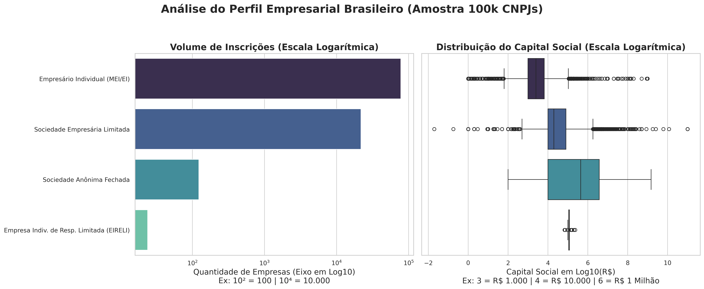

# Relatório

> [!CAUTION]
>
> - Você <ins>**não pode utilizar ferramentas de IA para escrever este relatório**</ins>.

## Identificação

- **Nome**: Pedro Marhofer Alles
- **Cartão UFRGS:** 00326188

## Dados utilizados

> [!IMPORTANT]
>
> - Os dados utilizados devem ser informados como **links** para as fontes originais.
> - Se houver mais de um conjunto de dados, liste todos separadamente.
> - Para cada conjunto de dados, inclua também uma **descrição curta** explicando os dados.

1. **Dataset 1**: (https://dados.gov.br/dados/conjuntos-dados/cadastro-nacional-da-pessoa-juridica---cnpj)
    * **Descrição curta**: amostra de 100 mil registros de empresas ativas do Brasil (CNPJ), contendo informações como natureza jurídica e capital social.

## Código-fonte da visualização

> [!IMPORTANT]
>
> - Indique abaixo onde está, dentro deste repositório, o código-fonte usado para gerar a visualização.

- **Arquivo principal**: [Visualizacao.ipynb](Visualizacao.ipynb)
- **Arquivos complementares (se houver)**: [amostra_cnpj_para_professor.csv](amostra_cnpj_para_professor.csv)

## Imagem da visualização gerada

> [!IMPORTANT]
>
> - Insira aqui uma imagem da visualização criada por você. Troque `imagem-da-visualizacao.png` pelo caminho correto do arquivo no repositório. 
> - Se você criou alguma visualização interativa, então descreva aqui como acessá-la. Por exemplo, se for uma página HTML, coloque o link, ou se for uma visualização 3D, descreva como compilar e executar o código. 

## Descrição da visualização

### Legenda (*caption*)

> [!IMPORTANT]
>
> - Escreva um texto curto explicando como interpretar a visualização. Descreva os elementos visuais, eixos, cores, símbolos ou interações relevantes.
> - Este texto seria a legenda (*caption*) que acompanharia a figura em uma publicação, por exemplo.

A imagem é composta por duas análises baseadas em uma amostra aleatória de 100 mil registros ativos do CNPJ. O gráfico à esquerda (barplot) apresenta o volume de inscrições categorizado por Natureza Jurídica, utilizando escala logarítmica no eixo X (base 10) para acomodar a grande diferença numérica entre as categorias. O gráfico à direita (boxplot) mostra a distribuição do Capital Social (em Reais) para as mesmas naturezas jurídicas, também em escala logarítmica no eixo X, evidenciando as medianas, quartis e outliers financeiros de cada modelo societário.

### Conclusão demonstrada pela visualização

> [!IMPORTANT]
>
> - Escreva uma conclusão curta sobre os dados com base na visualização.
> - Explique qual insight, padrão ou tendência pode ser observado.

A visualização demonstra uma clara diferença entre o volume de inscrições e a concentração de capital financeiro no cenário empresarial brasileiro. É possível notar que os Empresários Individuais (incluindo MEIs) dominam esmagadoramente o número absoluto de registros, mas apresentam a menor mediana e variação de capital social. Em contraste, as Sociedades Anônimas Fechadas, embora possuam um volume de cadastros muito pequeno (ficando à frente apenas das EIRELIs, que representam a menor categoria da amostra), concentram isoladamente os maiores valores de capital social. Isso evidencia como a riqueza está fortemente concentrada em tipos societários de alta complexidade, enquanto a base da pirâmide é formada por uma quantidade massiva de micro e pequenos negócios de baixíssimo capital.